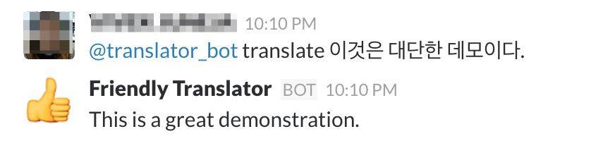

#About the Hack !

Naver Translator (http://labspace.naver.com/nmt/) has better translation quality for Korean to English than Google Translate. 
But, it does not expose API or allow more than 200 characters at one time for translation. 

It performs the following functions :-

1. Translate more than 200 words (in fact you can translate an entire news article)

2. Allow APIs : Translate API and Speech API (Speech API uses the installed Voice installed on MacOS)

3. A Proof of concept added to demonstrate integration with Slack as a bot

The Goal is to allow Naver Translator to be used for general Translation services. 

###How to Use ?

1. Run the api.py using `python api.py`. 
2. To use it as a Slack bot, do the following :- 
    
    a. Get the Slack API Token, and set the environment variable `export SLACK_BOT_TOKEN=<TOKEN>`
    
    b. Run `python print_bot_id.py` to get the Slack Bot ID. The Bot username is `translator` by default.
    
    c. Set the environment variable `export BOT_ID=<BOTID>`
    
    d. Run the Bot `python translate_bot.py`
    
    e. Add the `translator` bot to your Slack Channel
    
    f. Access the bot `@translator translate 이것은 대단한 데모이다.`
    
    
    
    
